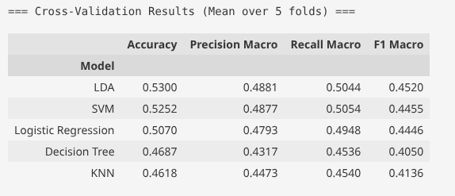
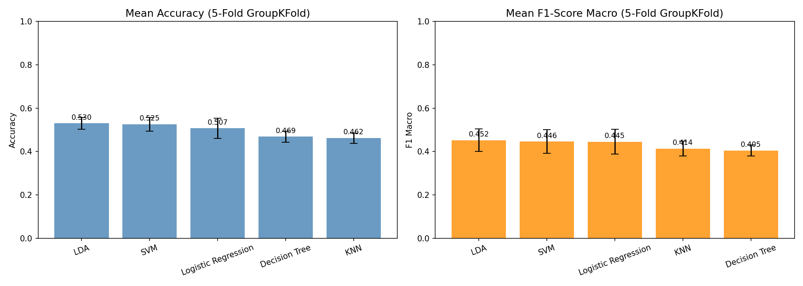

# EEG Dementia Classification — Experimental Branch (295 Features)

> **⚠️ Experimental Branch**  
> This branch contains the **second iteration** of feature engineering, expanding the original 105‑feature set to **295 features** by adding spectral entropy, Hjorth parameters, and normalized RMS.  
> **These additions did not improve overall classification performance**—in fact, the best model from the first iteration (Logistic Regression) saw a ~3% drop in accuracy.  
> The primary (`main`) branch retains the **105‑feature pipeline** (RBP + PLV) which achieved the highest subject‑wise accuracy (~53.7%).  
> This branch is kept for **reference, ablation studies, and transparency**.

---

## Objective

To test whether incorporating advanced EEG features—spectral entropy, Hjorth mobility/complexity, and normalized RMS—improves the classification of Alzheimer's Disease (AD), Frontotemporal Dementia (FTD), and healthy controls (CN) under strict subject‑wise cross‑validation.

---

## What Was Added (Second Iteration)

Building on the baseline of 95 Relative Band Power (RBP) features and 10 Phase Locking Value (PLV) connectivity features, we added:

| Feature Group | Description | Count |
| :--- | :--- | :---: |
| **Spectral Entropy** | Normalized Shannon entropy of the PSD, computed per frequency band (δ, θ, α, β, γ) and globally (0.5–45 Hz). | 19 × 6 = 114 |
| **Hjorth Parameters** | Activity (variance), Mobility (mean frequency estimate), and Complexity (bandwidth indicator) computed in the time domain. | 19 × 3 = 57 |
| **Normalized RMS** | Root‑mean‑square amplitude divided by standard deviation, reducing inter‑subject gain variability. | 19 × 1 = 19 |

**Total features per epoch: 95 (RBP) + 10 (PLV) + 114 + 57 + 19 = 295**

---

## Results

### Nested Cross‑Validation Performance

> *Training and scoring took approximately **65 minutes** with Nested CV.*

| Model | Accuracy (105‑feat baseline) | Accuracy (295‑feat) | Δ Accuracy |
| :--- | :---: | :---: | :---: |
| **LDA** | 0.5234 | **0.5300** | **+0.0066** |
| **SVM** | 0.5125 | **0.5252** | **+0.0127** |
| **Logistic Regression** | **0.5368** | 0.5070 | –0.0298 |
| **KNN** | 0.4666 | 0.4618 | –0.0048 |
| **Decision Tree** | 0.4531 | **0.4687** | **+0.0156** |

### Model Comparison Chart

- **LDA** became the best model at 53.0% accuracy (macro F1 = 0.452), marginally outperforming the 105‑feature baseline.
- **Logistic Regression**, the previous leader, dropped by ~3 percentage points, likely due to overfitting on redundant or noisy features.
- **SVM** and **Decision Tree** showed small gains, but the overall macro F1 scores remained below the best 105‑feature results.

---

## Why Did Performance Not Improve?

1. **Curse of Dimensionality:** With 295 features and ~28,000 training epochs per fold, the risk of overfitting increased substantially—especially for linear models like Logistic Regression.
2. **Feature Redundancy:** Many of the new features are highly correlated with existing RBP features (e.g., band‑specific entropy inversely tracks band power). The `SelectKBest` step (with `k` tuned in [100,150,200]) may not have been aggressive enough.
3. **Dataset Limitations:** The OpenNeuro ds004504 dataset is inherently challenging due to inter‑subject variability and clinical overlap between AD and FTD. Advanced features, while neurophysiologically plausible, did not add sufficient discriminative power.
4. **Hyperparameter Sensitivity:** The hyperparameter grids were originally designed for 105 features; a broader search might be required for the expanded set.

---

## Conclusion

**Adding spectral entropy, Hjorth parameters, and normalized RMS did not yield a net improvement in subject‑wise classification accuracy.**  
The leaner **105‑feature pipeline (RBP + PLV)** remains the optimal configuration, achieving **53.7% accuracy** with Logistic Regression under honest, leakage‑free validation.

This experiment underscores a key principle in biomedical machine learning: **more features do not automatically mean better performance**—especially when rigorous subject‑wise evaluation is enforced.

---

## Branch Comparison

| Criterion | `main` (105 features) | `experiment/295-features` (this branch) |
| :--- | :---: | :---: |
| Best Accuracy | **0.5368** (Logistic Regression) | 0.5300 (LDA) |
| Best Macro F1 | **0.4639** (Logistic Regression) | 0.4520 (LDA) |
| Total Features | 105 | 295 |
| Preprocessing Time | ~30–60 min | ~1–2 hours |
| Nested CV Runtime | ~35–45 min | ~60–70 min |

---

> **Note:** The code in this branch is fully functional and can be reused for other EEG datasets or further feature engineering explorations.