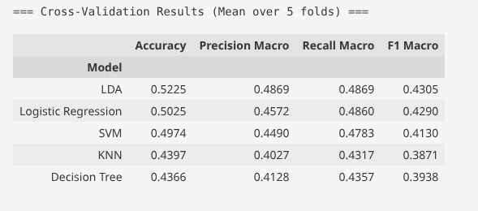

# EEG Dementia Classification — Legacy Branch (RBP Only)

> **⚠️ Legacy / Baseline Branch**  
> This branch contains the **initial pipeline** using only **Relative Band Power (RBP) features** extracted from 19 EEG channels (5 frequency bands each, total **95 features**).  
> No functional connectivity (PLV), no feature selection, and no nested cross‑validation are applied.  
> This code serves as a **historical baseline** to quantify the improvements achieved in later iterations (see `main` branch for the optimal 105‑feature pipeline).  


---

## Objective

To establish a minimal, leakage‑free baseline for classifying Alzheimer's Disease (AD), Frontotemporal Dementia (FTD), and healthy controls (CN) using only spectral power features. The results here illustrate the performance achievable with a straightforward feature set and proper subject‑wise validation.

---

## Pipeline Description (Baseline)

This branch implements a simple but **rigorous** evaluation protocol:

### 1. Subject‑Wise GroupKFold (No Data Leakage)
```python
gkf = GroupKFold(n_splits=5)
groups = df['subject_id'].values
```
- All epochs from a single subject are kept together in either the training or validation split.
- A sanity check asserts that no subject appears in both sets across all folds.

### 2. Normalization Inside the CV Loop
```python
def make_pipeline(classifier):
    return Pipeline([
        ('scaler', StandardScaler()),
        ('clf',    classifier)
    ])
```
- `StandardScaler` is fit **only on the training fold** and then applied to the validation fold, preventing information leakage from the test set.

### 3. No Feature Selection
- All 95 RBP features are used without any dimensionality reduction.
- This keeps the pipeline simple but increases the risk of overfitting.

---

## Results

Five classical classifiers were evaluated using 5‑fold `GroupKFold`:



> *Training and evaluation took approximately **11 minutes**.*
**Key Observations:**
- **LDA** performed best among the tested models, reaching 52.25% accuracy.
- All models scored well above the random‑guess baseline of 33.3%, confirming that spectral power alone carries discriminative information.
- The relatively low absolute accuracy is **expected** under strict subject‑wise validation—this is a realistic estimate of generalization to new patients.

---

## Comparison with Improved Pipelines

| Branch | Features | Best Accuracy | Best Model |
| :--- | :---: | :---: | :--- |
| `legacy/rbp-only` (this branch) | 95 RBP | 0.5225 | LDA |
| `main` (optimal) | 95 RBP + 10 PLV + SelectKBest + Nested CV | **0.5368** | Logistic Regression |

The enhancements introduced in the `main` branch yield a **+1.4 percentage point gain** in accuracy and provide a more robust, deployable model.

---